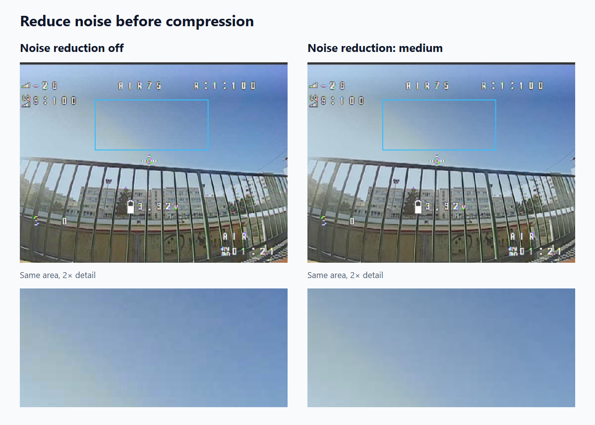
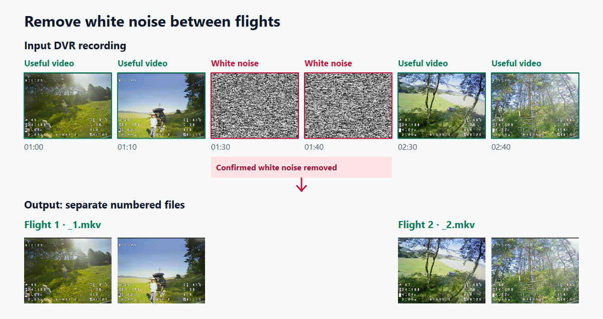
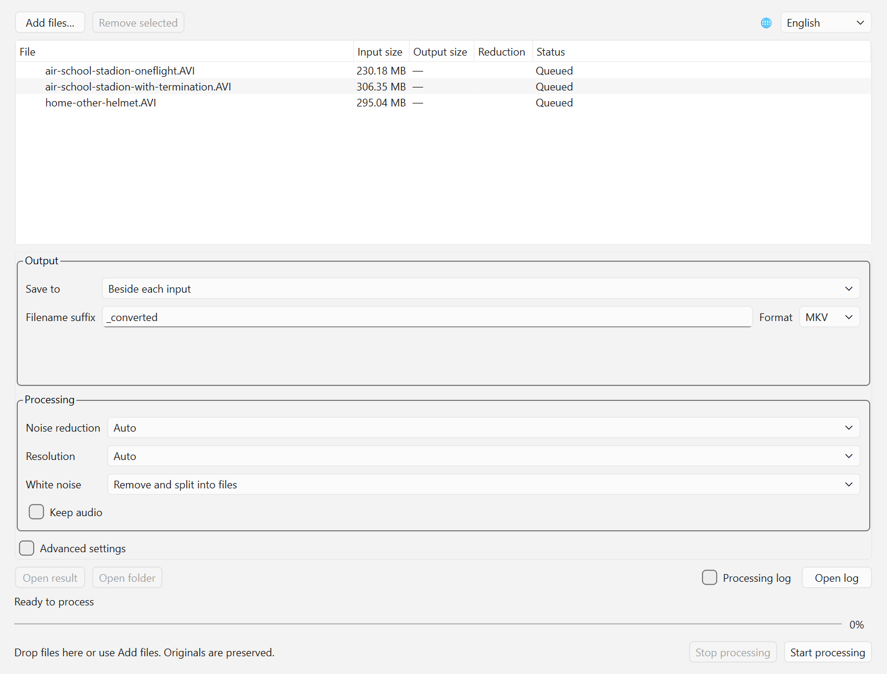

Translations: [Русский](docs/README_RU.md) · [Українська](docs/README_UK.md) · [Slovenčina](docs/README_SK.md)

# analog-fpv-compressor

**A video encoder for compressing DVR recordings from analog FPV drones.**
It reduces file size while preserving useful flight information.
The program combines noise reduction, automatic white-noise removal and flight
splitting in one workflow, available through a Windows GUI or an English CLI.

The priority is understandable drone movement, scene geometry and visible
obstacles. Fine textures can be reduced to save space. Automatic settings provide
a starting point; manual controls let you balance size, detail and processing time.
Original recordings are preserved. Audio is removed by default.

[**Download the Windows ZIP**](https://github.com/koolakoff/analog-fpv-compressor/releases/tag/v0.3.0)
· [Graphical interface](#graphical-interface) · [Console usage](#console-usage)

## Built for analog FPV recordings

### Reduce noise before compression

Random analog noise consumes bitrate; reducing it before encoding helps create
smaller files while retaining useful scene information. Noise reduction can be
adjusted or disabled to reduce processing work.



Real DVR frame at 02:24 from `air-school-stadion-oneflight`: filter off versus medium, before
video encoding. The marked area is enlarged 2× without a contrast boost.

### Automatically remove sustained white noise

The program detects confirmed stretches of white noise, such as the gap during
a battery change, and removes them instead of spending space on unusable video.
Short transition margins are retained to protect useful frames.



Schematic timeline using real DVR frames; spacing is not a time scale. The
highlighted white-noise section is removed, while the useful sections remain.

### Process multiple recordings and separate flights

Add several files to the queue or pass a wildcard to the CLI: each recording is
processed independently, and by default confirmed white-noise gaps separate it
into numbered outputs such as `flight_converted_1.mkv` and `_2.mkv`.
You can also remove noise and join the retained sections into one file.
Splitting follows signal loss; it does not detect takeoff or landing, so a long
signal loss during a flight can also create a boundary.

The creator of this program is the author of [this YouTube channel about FPV drones](https://www.youtube.com/channel/UCGZrwTM5WFiGD-B0F7V_9Kw).

Current source version **0.3.0** includes a Python core, CLI and graphical UI,
batch processing, automatic output names and snow-based splitting. Windows ZIP
**0.3.0** contains both GUI and CLI with Python and Qt included.
Joining multiple input
files and a dedicated application installer remain future work.

## Graphical interface

In a prepared local environment, run:

```powershell
.\.venv\Scripts\fpv-compress-gui.exe
```

For a new environment, see [GUI installation](docs/README-engineering.md#установка-gui).
FFmpeg is required for both interfaces. In the release ZIP, double-click
`fpv-compress-gui.exe`; no Python installation is needed. A local `fpv-compress.lnk` shortcut is
also available after running the shortcut script described in the engineering guide.



1. Click **Add files…** or drop videos into the window. Duplicate inputs are skipped.
2. Choose the output folder, filename suffix and container if needed.
3. Keep automatic settings or adjust noise reduction, resolution and white noise.
4. Click **Start processing**. Inputs are processed sequentially and independently.

The language selector is at the top right. On first launch, the UI uses the system
language if it is English, Russian, Ukrainian or Slovak; otherwise it uses English.
A manual selection is remembered. Switching languages does not interrupt processing.
Processing settings are locked while a job runs.

| Field or control | Purpose |
|---|---|
| Add files / remove selected | Manage the queue; drag and drop is also supported. |
| Language | English, Русский, Українська or Slovenčina. |
| Save to / folder | Beside each input, or in a shared output folder. |
| Filename suffix / format | Defaults: `_converted` and MKV; MP4 is available. Split outputs also receive a part number. |
| Noise reduction | Auto, off, weak, medium or strong. Off excludes the filter and reduces processing work. |
| Resolution / custom resolution | Auto, original or a selected width and height; affects detail and output size. |
| White noise | Default: remove and split into files. Alternatives: remove and join useful parts, or keep noise. |
| Keep audio | Off by default; when enabled, audio follows the same cuts as video. |
| Advanced settings | Reveal the following options; automatic values usually suffice. |
| Codec | AV1 by default; HEVC is an alternative. |
| Rate control / CRF / bitrate | Auto, CRF or a target bitrate. Lower CRF preserves more detail and produces a larger file. Bitrate is in bits/s, e.g. `500k`. |
| Encoder preset | Speed/compression tradeoff: `auto`, AV1 0–13 or an HEVC preset name. |
| Deinterlace / field order | Auto, off or on; auto, TFF or BFF field order for interlaced recordings. |
| Minimum white-noise duration | `auto` or confirmation time in seconds; brief interference should not split a flight. |
| CPU threads | Requested processing thread budget; default 4. |
| FFmpeg folder | Leave blank for automatic discovery, or choose a folder containing `ffmpeg.exe` and `ffprobe.exe`. |
| Analyze only | Record the plan, intervals and output names in the session log without encoding video. |
| Start / stop | Process the queue or cancel the current job; completed outputs remain. |
| Processing log / open log | Short messages in the window, or the complete diagnostic log of the current launch. |

Progress refers to the current stage and part. Reading and validation may show an
indeterminate indicator. **Ready** appears only after output validation. The queue
shows output size and savings; split parts appear as child rows. Select a result
or part to open it or its folder. Diagnostic details remain in English.

## Console usage

With a source installation, specifying inputs is enough:

```powershell
.\.venv\Scripts\fpv-compress.exe -i "C:\Videos\my.avi"
.\.venv\Scripts\fpv-compress.exe -i "first.avi" "second.avi"
.\.venv\Scripts\fpv-compress.exe -i "C:\Videos\*.avi" --output-dir "converted" --format mp4
.\.venv\Scripts\fpv-compress.exe -i "*.avi" --output-dir "converted" --output-suffix "_small"
```

The default outputs are `my_converted_1.mkv`, `_2.mkv`, etc., beside the input.
`--output-dir` selects a shared folder and creates it if necessary;
`--output-suffix` replaces `_converted`; `--format mp4` selects MP4.
The program expands wildcard patterns, so quoting them works across shells.
Repeated `-i` is supported and identical input paths are processed once.

`--split-flights` is enabled by default. Every nonempty retained interval gets a
numbered output, including a brief return of useful video. This detects snow
boundaries, not takeoff or landing: a long signal loss during a flight can split it.
Leading/trailing snow does not create empty files; one useful part still gets `_1`.
Blue screens and brief unconfirmed interference do not create split boundaries.

```powershell
# Remove snow but join useful intervals into one file:
.\.venv\Scripts\fpv-compress.exe -i "my.avi" --no-split-flights
# Keep snow and disable automatic splitting:
.\.venv\Scripts\fpv-compress.exe -i "my.avi" --cut-no-signal off
# Inspect the plan in the log without creating video:
.\.venv\Scripts\fpv-compress.exe -i "my.avi" --analyze-only
# Select explicit processing settings:
.\.venv\Scripts\fpv-compress.exe -i "my.avi" --denoise off --scale 480x360 --audio keep
```

`--no-signal-min-duration` controls snow confirmation time. `--audio keep` keeps
synchronized audio: FLAC in MKV, AAC in MP4. Explicit CRF and bitrate cannot be
set together. Deinterlace supports `auto`, `off`, `on`; field order supports
`auto`, `tff`, `bff`. See `--help` for all options.

`-o` accepts one input and cannot be combined with `--output-dir` or
`--output-suffix`; in split mode it sets the base filename. Explicit
`--split-flights` conflicts with `--cut-no-signal off`. Existing outputs and
colliding names are rejected. Choose a new output name for another run.

## Windows ZIP 0.3.0

1. Download the Windows x64 ZIP from [GitHub Releases](https://github.com/koolakoff/analog-fpv-compressor/releases).
2. Extract the entire folder; keep `_internal/` beside `fpv-compress.exe`.
3. **FFmpeg is not bundled.** If a compatible full build is missing, run
   `setup-ffmpeg.cmd`: it downloads and installs FFmpeg through WinGet and needs
   internet access. An existing full WinGet installation is detected automatically.
4. Double-click `fpv-compress-gui.exe` for the GUI, or open PowerShell for CLI:

```powershell
.\fpv-compress.exe -i "C:\Videos\flight.avi" -o "C:\Videos\flight-small.mkv"
```

This release targets Windows 10/11 x64 and includes Python, NumPy and Qt/PySide6.
If WinGet is unavailable, download a [full FFmpeg build](https://www.gyan.dev/ffmpeg/builds/)
and place `ffmpeg.exe` and `ffprobe.exe` in `tools/` beside the program.
The essentials build lacks the default AV1 encoder. Use `--ffmpeg-dir` for another
installation. Keep the entire folder together; create a Windows shortcut to the
GUI executable if desired. `licenses/` and `sources/` contain third-party license
materials and corresponding Qt sources; they require no installation.

## Results and diagnostics

The current program writes one **`fpv-compress.log` beside the launcher**, or
beside the environment's Python executable when run with `python -m`.
For local development: `.venv\Scripts\fpv-compress.log`.
**Each new program launch overwrites it.** Multiple queues within the same GUI
window append to that same file. The program folder must be writable;
CLI `--log-file PATH` selects another location, including for multi-file batches.

The log records versions, requested and automatic settings with reasons, removed
source intervals, processing start/end, validation, results and errors. It keeps
no per-frame progress and creates no separate FFmpeg logs. **No JSON reports are
created beside videos**, including in analyze-only and split modes. Plans and
checks are included in the main log. `--events-jsonl` enables live machine events
on stdout. Console output and diagnostic logs are in English.

For troubleshooting, send a copy of the log before launching the program again.
Already generated reports from earlier versions are not deleted automatically.
One input's failure does not stop the remaining queue; CLI exit code is 1 if any
input fails. Ctrl+C or **Stop** cancels processing, removes unfinished temporary
files and leaves completed outputs; CLI cancellation returns 130. An input made
entirely of snow is rejected unless noise removal is disabled.

## Further information

- [Engineering guide: installation, development environment, API, checks and releases](docs/README-engineering.md).
- [Current requirements and decisions](docs/source-of-truth.md).
- [Version 1 plan](docs/plan-v1.md).
- [DVR measurements](docs/research/cli-validation-2026-10-04.md), [batch checks](docs/research/batch-validation-2026-10-04.md), [GUI checks](docs/research/gui-validation-2026-10-04.md).

Application code is licensed under [MIT](LICENSE).
