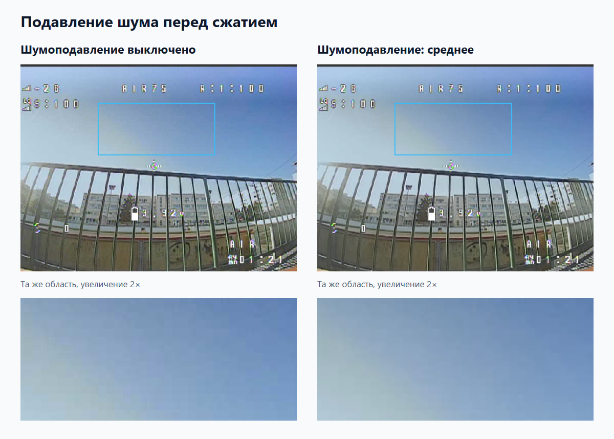
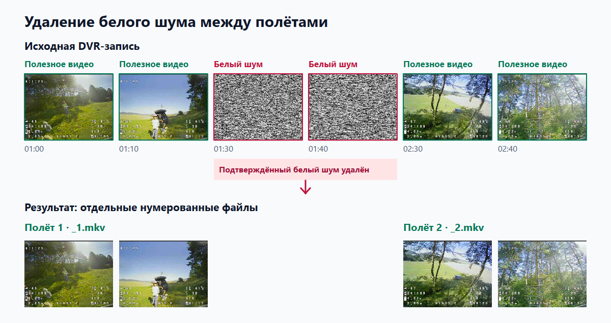
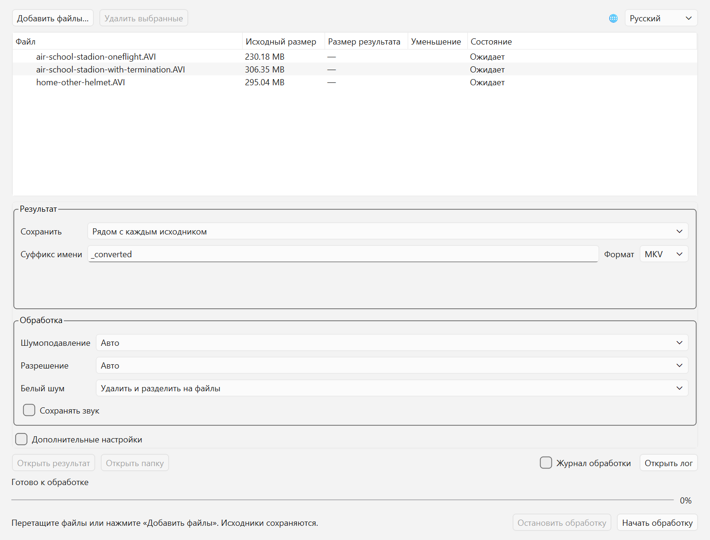

[English](../README.md) · Русский · [Українська](README_UK.md) · [Slovenčina](README_SK.md)

# analog-fpv-compressor

**Программа для кодирования и сжатия DVR-записей с аналоговых FPV-дронов.**
Позволяет уменьшить размер видео, сохраняя полезную информацию о полёте.
Программа объединяет подавление шума, автоматическое вырезание белого шума
и разделение полётов в одном процессе, с графическим интерфейсом Windows
и англоязычной консольной версией.

Приоритет — понятность движения дрона, геометрия сцены и видимые препятствия.
Мелкие текстуры можно уменьшить ради компактного файла. Автоматические
настройки дают отправную точку, а ручные позволяют выбрать баланс размера,
детализации и времени обработки. Исходные записи сохраняются.
Звук по умолчанию удаляется.

[**Скачать Windows ZIP**](https://github.com/koolakoff/analog-fpv-compressor/releases/tag/v0.3.0)
· [Графический интерфейс](#графический-интерфейс--030) · [Консольная версия](#быстрый-старт)

## Особенности для аналогового FPV

### Подавление шума перед сжатием

Случайный аналоговый шум расходует битрейт: подавление перед кодированием
помогает получить меньший файл, сохранив полезную информацию о сцене.
Степень подавления можно выбрать вручную или выключить фильтр для ускорения.



Реальный DVR-кадр на 02:24 из `air-school-stadion-oneflight`: фильтр выключен и средний
уровень, до кодирования видео. Выделенная область увеличена в 2 раза без
усиления контраста.

### Автоматическое удаление длительного белого шума

Программа находит подтверждённые участки белого шума, например при смене
батареи, и вырезает их, чтобы не тратить место на неинформативное видео.
Небольшие запасы около переходов сохраняются для защиты полезных кадров.



Схематическая лента из реальных DVR-кадров; расстояния не соответствуют
временному масштабу. Отмеченная часть белого шума удаляется, полезные участки остаются.

### Несколько записей и отдельные полёты

Добавьте несколько файлов в очередь или передайте wildcard в консоли:
записи обрабатываются независимо, а по умолчанию подтверждённые разрывы
белого шума разделяют запись на файлы `flight_converted_1.mkv`, `_2.mkv` и далее.
Можно также удалить шум и соединить сохраняемые участки в один файл.
Разделение следует потере сигнала, не взлёту или посадке: длительная потеря
сигнала в полёте тоже может создать границу.

Создатель программы — автор [YouTube-канала о FPV-дронах](https://www.youtube.com/channel/UCGZrwTM5WFiGD-B0F7V_9Kw).

Сейчас доступны Python-ядро, консольный и графический интерфейсы. В исходниках
**0.3.0** добавлен GUI; batch, автоматические имена и разделение по снегу доступны
в обоих интерфейсах. Windows ZIP **0.3.0** содержит GUI и CLI вместе с Python,
NumPy и Qt/PySide6. Склейка входов и инсталлер остаются будущими задачами.

## Графический интерфейс — 0.3.0

В подготовленной локальной среде запустить:

```powershell
.\.venv\Scripts\fpv-compress-gui.exe
```

Для новой среды — [установка GUI из исходников](README-engineering.md#установка-gui).
FFmpeg требуется и для GUI. В ZIP запустить `fpv-compress-gui.exe` двойным
щелчком; устанавливать Python не нужно.

1. Нажать «Добавить файлы…» или перетащить видео в окно. Повторы исключаются.
2. При необходимости выбрать папку результатов, суффикс и формат.
   По умолчанию `INPUT_converted_1.mkv`, `_2.mkv` и далее сохраняются рядом с каждым исходником.
3. Оставить автонастройки или изменить шумоподавление и разрешение.
   В «Белый шум» выбрать сохранение, удаление с объединением полезных частей
   или удаление с разделением на номерные файлы — это режим по умолчанию.
   Звук по умолчанию удаляется.
4. Нажать «Начать обработку». Файлы обрабатываются последовательно.

Язык выбирается справа сверху: English, Русский, Українська, Slovenčina.
Первый запуск выбирает поддерживаемый язык системы, иначе английский.
Ручной выбор запоминается; смена языка не прерывает обработку. Основные параметры
во время задания заблокированы. Дополнительные настройки открывают кодек,
CRF/битрейт, preset, deinterlace, порог снега, CPU threads, папку FFmpeg
и режим «Только анализ».

Процент относится к текущему этапу и части. Чтение и проверка используют
неопределённый индикатор; «Готово» появляется после проверки результата.
Выбранные автонастройки показываются под статусом. Размер результата и
уменьшение — в таблице, отдельные части раскрываются под исходником.
Выбрать результат/часть, затем «Открыть результат», «Открыть папку» или
«Открыть лог». Детальная диагностика в общем логе остаётся на английском.



| Поле | Назначение |
|---|---|
| Добавить файлы / удалить выбранные | Состав очереди; можно также перетащить файлы в окно. |
| Язык справа сверху | English, Русский, Українська, Slovenčina; ручной выбор сохраняется. |
| Сохранить в / папка | Рядом с каждым исходником или в общей выбранной папке. |
| Суффикс имени / формат | По умолчанию `_converted` и MKV; доступен MP4. При разделении добавляется номер части. |
| Шумоподавление | Авто, выключено, слабое, среднее, сильное. Выключение исключает фильтр и ускоряет обработку. |
| Разрешение / пользовательское разрешение | Авто, исходное или заданные ширина и высота; влияет на детализацию и размер результата. |
| Белый шум | По умолчанию удалить и разделить на файлы; также можно удалить и объединить полезные части или сохранить шум. |
| Сохранить звук | По умолчанию выключено; при включении звук обрабатывается синхронно с видео. |
| Дополнительные настройки | Раскрывает параметры ниже; обычно их можно оставить автоматическими. |
| Кодек | AV1 по умолчанию; HEVC — альтернативный вариант. |
| Управление сжатием / CRF / битрейт | Авто, CRF или целевой битрейт. Меньший CRF сохраняет больше деталей, но увеличивает файл. Битрейт задаётся в бит/с, например `500k`. |
| Preset кодировщика | Компромисс скорости и сжатия: `auto`, число 0–13 для AV1 или название preset для HEVC. |
| Deinterlace / порядок полей | Авто, выключено или включено; порядок полей — авто, TFF или BFF. Нужен для чересстрочных записей. |
| Минимальная длительность белого шума | `auto` или секунды подтверждения шумного участка; короткие помехи не должны разрезать полёт. |
| Потоки CPU | Запрошенный бюджет потоков обработки; по умолчанию 4. |
| Папка FFmpeg | Обычно пусто: автоматический поиск. При необходимости выбрать каталог с `ffmpeg.exe` и `ffprobe.exe`. |
| Только анализ | Записать выбранные параметры, интервалы и имена частей в лог без кодирования видео. |
| Начать / остановить | Запуск очереди или отмена текущей обработки; готовые результаты сохраняются. |
| Лог обработки / открыть лог | Краткие сообщения в окне или полный диагностический файл текущего запуска. |

«Остановить обработку» прекращает очередь, готовые файлы сохраняются.
Закрытие окна во время работы предлагает отмену и ждёт очистки.
При конфликте имён файлы не перезаписываются: для повторного запуска выбрать
другой каталог или суффикс. Уже созданные логи также защищены от перезаписи.

## Быстрый старт

1. Скачать ZIP для Windows x64 из [GitHub Releases](https://github.com/koolakoff/analog-fpv-compressor/releases).
2. Распаковать **всю папку**, сохранив `_internal/` рядом с `fpv-compress.exe`.
3. **FFmpeg в ZIP не включён.** Если совместимая full-сборка ещё не установлена,
   запустить приложенный `setup-ffmpeg.cmd`: он скачает и установит FFmpeg
   через WinGet. Для этого нужен интернет. Если FFmpeg уже установлен через
   WinGet, повторная установка не требуется.
4. Запустить `fpv-compress-gui.exe` двойным щелчком или открыть PowerShell
   в распакованной папке для CLI:

```powershell
.\fpv-compress.exe -i "C:\Videos\flight.avi" -o "C:\Videos\flight-small.mkv"
```

ZIP рассчитан на Windows 10/11 x64. Python, NumPy и Qt/PySide6 включены.
`licenses/` и `sources/` содержат лицензии и соответствующие исходники Qt;
их не нужно устанавливать. Папку архива сохранять целиком.
Если WinGet недоступен, скачать [full-сборку FFmpeg](https://www.gyan.dev/ffmpeg/builds/)
вручную и положить `ffmpeg.exe` и `ffprobe.exe` в `tools/` рядом с нашей
программой. Essentials-сборка не подходит для AV1 по умолчанию.
Для другой существующей установки можно задать `--ffmpeg-dir "C:\path\to\bin"`.
Установка из исходников и запуск разработки описаны в
[инженерном README](README-engineering.md).

## Настройки и примеры

Явное имя результата работает как в ZIP 0.1.0, так и в текущих исходниках:

```powershell
.\fpv-compress.exe -i "input.avi" -o "output.mkv"
```

По умолчанию используются AV1 CRF 48/preset 6, средний HQDN3D и исходное
разрешение. Программа автоматически проверяет необходимость deinterlace,
осторожно вырезает длительный снег и **удаляет звук**. Синий экран автоматически
не вырезается: внутри него могут кратковременно появляться полезные кадры.
Это начальные настройки, проверенные на трёх DVR-записях.

| Параметр | Назначение |
|---|---|
| `--scale 480x360` | Уменьшить разрешение, сохранив отображаемые пропорции |
| `--denoise auto\|off\|weak\|medium\|strong` | Выбрать степень шумоподавления или отключить его |
| `--deinterlace auto\|off\|on` | Автоматический выбор либо ручное управление deinterlace |
| `--cut-no-signal auto\|off` | Автоматически вырезать снег либо оставить его |
| `--no-signal-min-duration SECONDS` | Задать минимальную длительность для подтверждения снега |
| `--audio keep` | Сохранить звук; по умолчанию удаляется |
| `--crf N` | Задать качество: большее число усиливает сжатие и потери деталей |
| `--bitrate 500k` | Задать целевой видеобитрейт вместо ручного CRF |
| `--codec hevc --preset medium` | Использовать HEVC вместо AV1 |
| `--analyze-only` | Записать план в общий лог без создания видео |

Компактный вариант, сохранение звука и отключение дополнительных этапов:

```powershell
.\fpv-compress.exe -i "input.avi" -o "compact.mkv" --scale 480x360
.\fpv-compress.exe -i "input.avi" -o "with-audio.mp4" --audio keep
.\fpv-compress.exe -i "input.avi" -o "no-filters.mkv" --denoise off --deinterlace off --cut-no-signal off
.\fpv-compress.exe -i "input.avi" -o "plan.mkv" --analyze-only
.\fpv-compress.exe --help
```

Поддержаны MKV и MP4. При сохранении звука используется FLAC для MKV и AAC
для MP4; вырезание синхронно применяется к видео и аудио. Явные CRF и bitrate
одновременно задавать нельзя. Все параметры перечислены в `--help`.

## Несколько файлов и разделение по полётам — 0.2.0

После установки из исходников использовать локальную команду
`.\.venv\Scripts\fpv-compress.exe`. Теперь достаточно указать только вход:

```powershell
.\.venv\Scripts\fpv-compress.exe -i "C:\Videos\my.avi"
```

Получится `C:\Videos\my_converted_1.mkv`; при нескольких полётах появятся `_2`, `_3` и далее. Без `--output-dir` каждый результат
лежит рядом со своим входом. Default — MKV; `--format mp4` выбирает MP4.

```powershell
.\.venv\Scripts\fpv-compress.exe -i "first.avi" "second.avi"
.\.venv\Scripts\fpv-compress.exe -i "C:\Videos\*.avi" --output-dir "converted" --format mp4
.\.venv\Scripts\fpv-compress.exe -i "*.avi" --output-dir "converted" --output-suffix "_small"
.\.venv\Scripts\fpv-compress.exe -i "my.avi" --split-flights
```

`--output-dir` создаётся при необходимости. `--output-suffix` заменяет
`_converted`; каталог и суффикс можно использовать вместе. Wildcard раскрывает
сама программа: удобно передавать шаблон в кавычках. Несколько `-i` также
поддерживаются. Повторно указанный файл обрабатывается один раз, файлы
обрабатываются последовательно и независимо.

По умолчанию включён `--split-flights`: создаются `my_converted_1.mkv`, `my_converted_2.mkv` и далее
по подтверждённым промежуткам белого шума. Каждый сохраняемый участок становится
отдельным файлом, даже краткое возвращение полезной картинки. Это не определение
взлётов и посадок: длительная потеря сигнала внутри полёта тоже создаст границу.
Снег в начале/конце не создаёт пустых файлов; одна полезная часть получает `_1`.
Синий экран и краткие неподтверждённые помехи не разделяют запись.
`--no-signal-min-duration` управляет подтверждением снега и для split.

С `--no-split-flights` сохраняемые участки склеиваются в один результат для каждого входа.
`--cut-no-signal off` сохраняет снег и автоматически отключает разделение;
явное сочетание с `--split-flights` отклоняется.
С `--analyze-only --split-flights` можно сначала увидеть план и имена частей,
не создавая видео. `--audio keep` сохраняет синхронный звук в каждой части.

`-o` принимает только один вход. `--log-file` задаёт общий лог запуска, включая пакет. `-o` нельзя
сочетать с `--output-dir` или `--output-suffix`; в split оно задаёт базовое имя
для нумерации частей. `--split-flights` несовместим с `--cut-no-signal off`.
При совпадении выходных имён, например у двух входов с одинаковым именем
из разных папок, программа сообщает ошибку и ничего не перезаписывает.

## Результат и логи

Папка назначения должна существовать. Исходник и существующие результаты
не перезаписываются; для повторного запуска выбрать новое имя результата.
Отмена обработки — **Ctrl+C**, незавершённый временный результат удаляется.

Программа сохраняет один диагностический файл `fpv-compress.log` рядом
с исполняемым файлом и **перезаписывает его при следующем запуске программы**.
При запуске из локальной `.venv` это `.venv\Scripts\fpv-compress.log`.
Все очереди в одном открытом окне GUI попадают в этот же файл; кнопка
«Открыть лог» открывает его. При ошибке этот файл можно отправить для анализа,
сохранив копию до следующего запуска. В нём записаны версии, настройки и причины
auto-выбора, удалённые интервалы, начало/конец обработки, проверки и ошибки;
покадровый прогресс не записывается. Отдельных FFmpeg-логов нет.
Папка программы должна быть доступна для записи; в CLI путь можно изменить
через `--log-file`. Лог и консольный вывод — на английском.

План, таймкоды, проверки и сведения о готовых частях сохраняются только в
общем логе, включая `--analyze-only`. JSON-файлы рядом с видео не создаются.
Ранее созданные отчёты автоматически не удаляются.
Машинные события в stdout включаются через `--events-jsonl`.

Лог остаётся общим и при разделении на части. Ошибка одного входа не мешает
пакету обработать остальные; общий exit code — 1 при любой ошибке. Ctrl+C
останавливает весь пакет с exit code 130. Уже готовые файлы сохраняются,
незавершённые временные файлы удаляются.

Если весь вход состоит из снега, автоматический режим сообщает ошибку.
Для намеренного сохранения такого видео использовать `--cut-no-signal off`.

## Дополнительная информация

- [Инженерный README: установка, среда, API, проверки и выпуск релиза](README-engineering.md).
- [Источник истины: актуальные требования и решения](source-of-truth.md).
- [План первой версии](plan-v1.md).
- [Измерения и проверка программы на DVR-записях](research/cli-validation-2026-10-04.md).
- [Проверка пакетной обработки и разделения](research/batch-validation-2026-10-04.md).
- [Проверка графического интерфейса](research/gui-validation-2026-10-04.md).

Код проекта распространяется под [MIT](../LICENSE).
