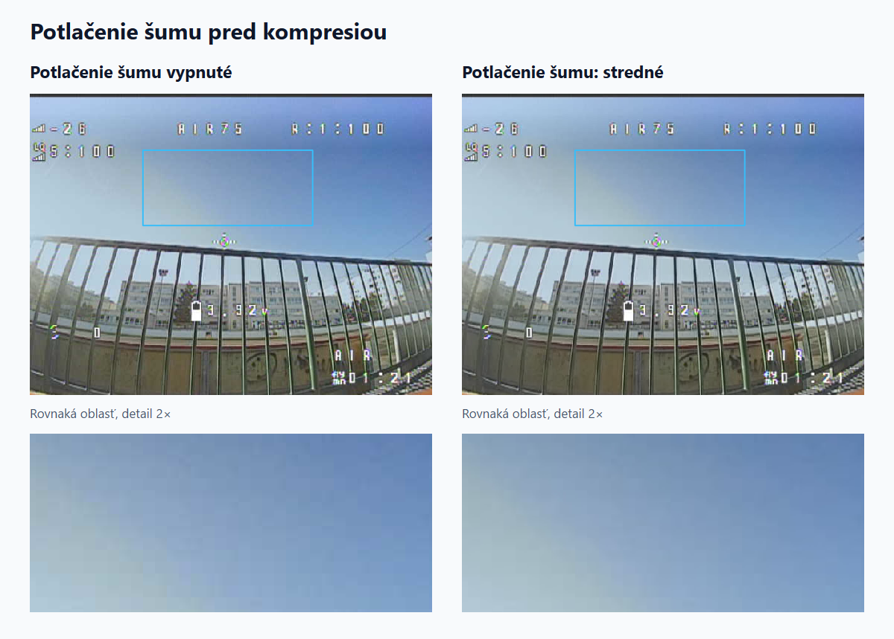
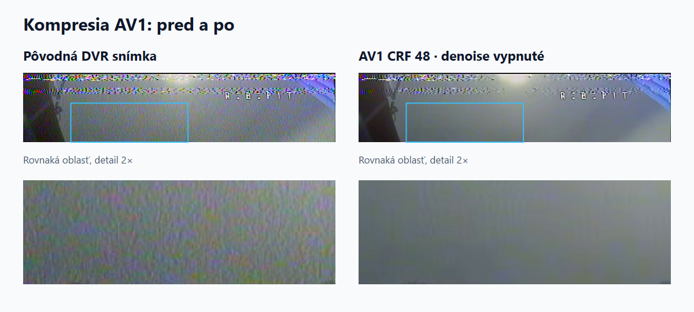
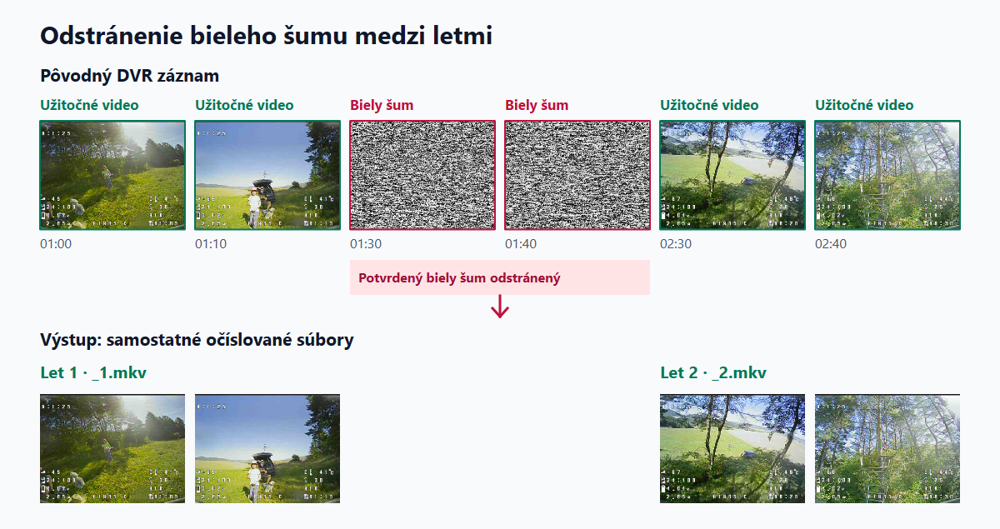
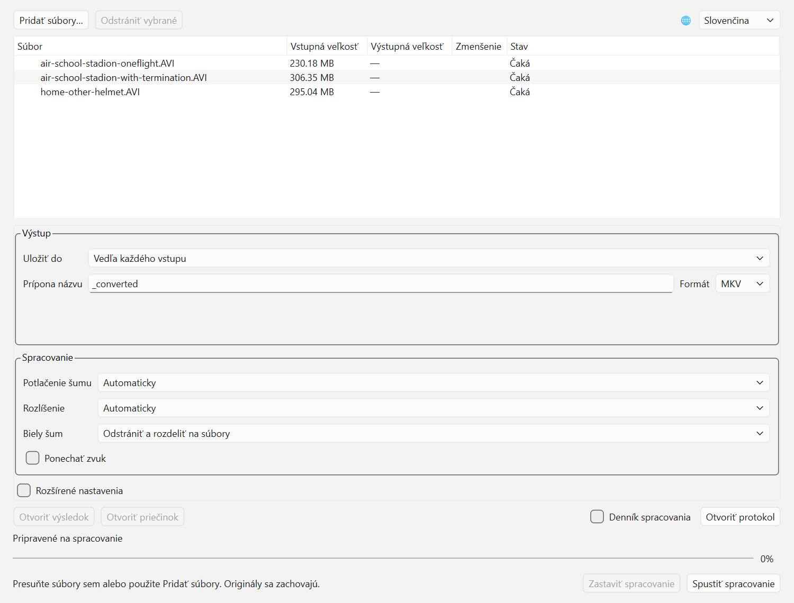

[English](../README.md) · [Русский](README_RU.md) · [Українська](README_UK.md) · Slovenčina

# analog-fpv-compressor

**Program na kódovanie a kompresiu DVR záznamov z analógových FPV dronov.**
Umožňuje zmenšiť veľkosť videa pri zachovaní užitočných informácií o lete.
Program spája potlačenie šumu, automatické odstránenie bieleho šumu a rozdelenie
letov do jedného postupu, s grafickým rozhraním pre Windows a anglickým CLI.

Prioritou je zrozumiteľný pohyb dronu, geometria scény a viditeľné prekážky.
Jemné textúry možno obmedziť kvôli menšiemu súboru. Automatické nastavenia sú
východiskom; ručné umožňujú zvoliť pomer veľkosti, detailov a času spracovania.
Pôvodné záznamy zostávajú zachované. Zvuk sa predvolene odstráni.

[**Stiahnuť Windows ZIP**](https://github.com/koolakoff/analog-fpv-compressor/releases/tag/v0.4.0)
· [Grafické rozhranie](#grafické-rozhranie) · [Konzolová verzia](#konzola)

## Funkcie pre analógové FPV záznamy

### Potlačenie šumu pred kompresiou

Náhodný analógový šum spotrebúva dátový tok; jeho potlačenie pred kódovaním
pomáha vytvoriť menší súbor pri zachovaní užitočných informácií o scéne.
Intenzitu možno nastaviť ručne alebo filter vypnúť pre rýchlejšie spracovanie.

V našich testoch stredné potlačenie šumu dodatočne zmenšilo súbor približne
o **2–3% pri úsekoch letu** a **až o 16% pri jednotlivých úsekoch**, v závislosti
od scény a nastavení kodeku. Ide o dodatočnú úsporu pri rovnakých nastaveniach
kodeku, nie o celkové zmenšenie oproti pôvodnému DVR súboru.
[Výsledky meraní](research/denoise-recheck-2026-10-05.md).



Skutočný DVR záber o 02:24 zo záznamu `air-school-stadion-oneflight`, bez ľudí:
vypnutý filter a stredná intenzita, pred kódovaním videa. Označená oblasť je
zväčšená 2× bez zvýšenia kontrastu. Vizuálny rozdiel je malý.

### Kompresia kodekom AV1

Predvolený videokodek je **AV1**, kódovaný pomocou **SVT-AV1** cez FFmpeg.
Alternatívou je HEVC/H.265. MKV a MP4 sú súborové kontajnery; kodek určuje,
ako sa komprimuje video vnútri.



Rovnaká snímka o 01:36,067 zo záznamu `home-other-helmet`, orezaná bez ľudí:
originál a AV1 CRF48/preset6, **denoise vypnuté**. Detail je zväčšený 2×.
Stratové kódovanie tu viditeľne vyhladzuje jemný šum, ale môže odstrániť aj
skutočné jemné detaily. Príklad samostatne ukazuje prínos kodeku.

### Automatické odstránenie dlhého bieleho šumu

Program rozpozná potvrdené úseky bieleho šumu, napríklad počas výmeny batérie,
a odstráni ich, aby nezaberali miesto v zázname. Krátke okraje pri prechodoch
zostávajú zachované na ochranu užitočných záberov.



Schematická časová os zo skutočných DVR záberov; rozostupy nie sú časovou
mierkou. Označený úsek bieleho šumu sa odstráni, užitočné časti zostanú.

### Viac záznamov a samostatné lety

Pridajte viac súborov do zoznamu alebo použite wildcard v CLI:
záznamy sa spracujú nezávisle a potvrdené medzery bieleho šumu predvolene
rozdelia záznam na súbory `flight_converted_1.mkv`, `_2.mkv` a ďalšie.
Šum možno tiež odstrániť a zachované úseky spojiť do jedného súboru.
Rozdelenie sleduje stratu signálu, nie vzlet či pristátie: dlhá strata signálu
počas letu môže tiež vytvoriť hranicu.

Tvorcom programu je autor [tohto YouTube kanála o FPV dronoch](https://www.youtube.com/channel/UCGZrwTM5WFiGD-B0F7V_9Kw).

Aktuálna zdrojová verzia **0.4.0** obsahuje jadro v Pythone, CLI, grafické
rozhranie, dávkové spracovanie, automatické názvy a rozdelenie podľa šumu.
Windows ZIP **0.4.0** obsahuje GUI aj CLI spolu s Pythonom, NumPy a Qt/PySide6.
Spájanie viacerých
vstupných záznamov a samostatný inštalátor aplikácie sú plánované do budúcnosti.

## Grafické rozhranie

V pripravenom lokálnom prostredí spustite:

```powershell
.\.venv\Scripts\fpv-compress-gui.exe
```

Pre nové prostredie pozrite [inštaláciu GUI](README-engineering.md#установка-gui).
FFmpeg je potrebný pre obe rozhrania. V ZIP spustite `fpv-compress-gui.exe`
dvojklikom; Python netreba inštalovať. Skript opísaný v technickej príručke
vytvorí aj lokálneho zástupcu `fpv-compress.lnk`.



1. Kliknite na **Pridať súbory…** alebo pretiahnite videá do okna. Duplicity sa vynechajú.
2. Podľa potreby vyberte priečinok výsledkov, príponu názvu a kontajner.
3. Ponechajte automatické nastavenia alebo upravte potlačenie šumu, rozlíšenie a biely šum.
4. Kliknite na **Spustiť spracovanie**. Vstupy sa spracujú postupne a nezávisle.

Výber jazyka je vpravo hore. Pri prvom spustení sa použije jazyk systému, ak ide
o angličtinu, ruštinu, ukrajinčinu alebo slovenčinu; inak angličtina. Ručný výber
sa zapamätá. Zmena jazyka nepreruší spracovanie. Nastavenia spracovania sú počas
bežiacej úlohy zablokované.

| Pole alebo ovládací prvok | Účel |
|---|---|
| Pridať súbory / odstrániť vybrané | Správa zoznamu; podporované je aj pretiahnutie súborov. |
| Jazyk | English, Русский, Українська alebo Slovenčina. |
| Uložiť do / priečinok | Vedľa každého vstupu alebo do spoločného priečinka výsledkov. |
| Prípona názvu / formát | Predvolene `_converted` a MKV; dostupný je MP4. Rozdelené súbory dostanú aj číslo časti. |
| Potlačenie šumu | Automaticky, vypnuté, slabé, stredné alebo silné. Vypnutie vynechá filter a zníži množstvo spracovania. |
| Rozlíšenie / vlastné rozlíšenie | Automatické, pôvodné alebo zvolená šírka a výška; ovplyvňuje detaily a veľkosť výsledku. |
| Biely šum | Predvolene odstrániť a rozdeliť na súbory. Alternatívy: odstrániť a spojiť užitočné časti alebo šum ponechať. |
| Zachovať zvuk | Predvolene vypnuté; zvuk sa strihá rovnako ako video. |
| Rozšírené nastavenia | Zobrazí nasledujúce možnosti; automatické hodnoty zvyčajne postačujú. |
| Kodek | Predvolene AV1; alternatívou je HEVC. |
| Riadenie kompresie / CRF / dátový tok | Automaticky, CRF alebo cieľový dátový tok. Nižšie CRF zachová viac detailov a zväčší súbor. Dátový tok je v bit/s, napríklad `500k`. |
| Predvoľba enkodéra | Kompromis rýchlosti a kompresie: `auto`, AV1 0–13 alebo názov predvoľby HEVC. |
| Odstránenie prekladania / poradie polí | Automaticky, vypnuté alebo zapnuté; poradie automaticky, TFF alebo BFF pri prekladanom videu. |
| Minimálna dĺžka bieleho šumu | `auto` alebo čas potvrdenia v sekundách; krátke rušenie nemá rozdeliť let. |
| Vlákna CPU | Požadovaný počet vlákien spracovania; predvolene 4. |
| Priečinok FFmpeg | Prázdny znamená automatické vyhľadanie; môžete vybrať priečinok s `ffmpeg.exe` a `ffprobe.exe`. |
| Iba analýza | Zapíše plán, intervaly a názvy častí do protokolu bez kódovania videa. |
| Spustiť / zastaviť | Spracuje zoznam alebo zruší aktuálnu úlohu; hotové výsledky zostanú. |
| Protokol spracovania / otvoriť protokol | Stručné správy v okne alebo úplný diagnostický protokol aktuálneho spustenia. |

Percentá patria aktuálnej fáze a časti. Čítanie a kontrola môžu používať
neurčitý indikátor. **Hotovo** sa zobrazí až po overení výsledku. Zoznam ukazuje
veľkosť a úsporu; časti sú vnorené riadky. Vyberte výsledok alebo časť a otvorte
súbor či jeho priečinok. Diagnostické podrobnosti zostávajú v angličtine.

## Konzola

Po inštalácii zo zdrojového kódu stačí zadať vstupy:

```powershell
.\.venv\Scripts\fpv-compress.exe -i "C:\Videos\my.avi"
.\.venv\Scripts\fpv-compress.exe -i "first.avi" "second.avi"
.\.venv\Scripts\fpv-compress.exe -i "C:\Videos\*.avi" --output-dir "converted" --format mp4
.\.venv\Scripts\fpv-compress.exe -i "*.avi" --output-dir "converted" --output-suffix "_small"
```

Predvolené výsledky sú `my_converted_1.mkv`, `_2.mkv` atď. vedľa vstupu.
`--output-dir` vyberie spoločný priečinok a podľa potreby ho vytvorí;
`--output-suffix` nahradí `_converted`, `--format mp4` vyberie MP4.
Zástupné znaky rozbalí program: vzory zadávajte v úvodzovkách. Opakované `-i`
je podporované a rovnaká vstupná cesta sa spracuje iba raz.

`--split-flights` je predvolene zapnuté. Každý neprázdny zachovaný interval
dostane očíslovaný výstup, aj pri krátkom návrate užitočného videa. Rozhodujú
hranice šumu, nie vzlet či pristátie: dlhá strata signálu počas letu ho môže
rozdeliť. Šum na začiatku/konci nevytvára prázdne súbory; aj jediná časť dostane
`_1`. Modrá obrazovka a krátke nepotvrdené rušenie nevytvárajú hranice rozdelenia.

```powershell
# Odstrániť šum, ale spojiť užitočné intervaly:
.\.venv\Scripts\fpv-compress.exe -i "my.avi" --no-split-flights
# Ponechať šum a vypnúť automatické rozdelenie:
.\.venv\Scripts\fpv-compress.exe -i "my.avi" --cut-no-signal off
# Zapísať plán do protokolu bez vytvorenia videa:
.\.venv\Scripts\fpv-compress.exe -i "my.avi" --analyze-only
# Zadať konkrétne nastavenia:
.\.venv\Scripts\fpv-compress.exe -i "my.avi" --denoise off --scale 480x360 --audio keep
```

`--no-signal-min-duration` určuje čas potvrdenia šumu. `--audio keep` zachová
synchronizovaný zvuk: FLAC v MKV, AAC v MP4. CRF a dátový tok nemožno naraz
zadať ručne. Deinterlace podporuje `auto`, `off`, `on`; poradie polí `auto`,
`tff`, `bff`. Všetky možnosti nájdete v `--help`.

`-o` prijíma jeden vstup a nemožno ho kombinovať s `--output-dir` alebo
`--output-suffix`; pri rozdelení určuje základ názvu. Výslovné `--split-flights`
je v konflikte s `--cut-no-signal off`. Existujúce výsledky a kolízie názvov sa
odmietnu. Pri opakovanom spracovaní vyberte nový názov.

## Windows ZIP 0.4.0

1. Stiahnite Windows x64 ZIP z [GitHub Releases](https://github.com/koolakoff/analog-fpv-compressor/releases).
2. Rozbaľte celý priečinok; `_internal/` musí zostať vedľa `fpv-compress.exe`.
3. **FFmpeg nie je súčasťou ZIP.** Ak chýba kompatibilná full zostava, spustite
   `setup-ffmpeg.cmd`: stiahne a nainštaluje FFmpeg cez WinGet; potrebuje
   internet. Existujúca full inštalácia WinGet sa rozpozná automaticky.
4. Spustite `fpv-compress-gui.exe` dvojklikom alebo otvorte PowerShell pre CLI:

```powershell
.\fpv-compress.exe -i "C:\Videos\flight.avi" -o "C:\Videos\flight-small.mkv"
```

Vydanie je určené pre Windows 10/11 x64 a obsahuje Python, NumPy a Qt/PySide6.
Bez WinGet stiahnite [full zostavu FFmpeg](https://www.gyan.dev/ffmpeg/builds/)
a vložte `ffmpeg.exe` a `ffprobe.exe` do `tools/` vedľa programu.
Essentials neobsahuje predvolený enkodér AV1. Inú inštaláciu zadajte cez
`--ffmpeg-dir`. Ponechajte celý priečinok spolu. `licenses/` a `sources/` obsahujú
licencie a zodpovedajúce zdrojové archívy Qt; netreba ich inštalovať.

## Výsledky a diagnostika

Aktuálny program zapisuje jediný **`fpv-compress.log` vedľa spúšťacieho súboru**,
alebo vedľa Pythonu daného prostredia pri `python -m`. Lokálne:
`.venv\Scripts\fpv-compress.log`. **Pri každom novom spustení programu sa protokol prepíše.**
Viacero dávok v jednom otvorenom GUI sa pripisuje do rovnakého súboru. Priečinok
programu musí umožňovať zápis; CLI `--log-file PATH` vyberie iné miesto pre celý beh.

Protokol zaznamenáva verzie, požadované a automatické nastavenia s dôvodmi,
odstránené intervaly pôvodného videa, začiatok/koniec spracovania, kontroly,
výsledky a chyby. Nezapisuje priebeh po jednotlivých snímkach ani samostatné
FFmpeg protokoly. **Vedľa videí nevznikajú JSON správy**, ani pri analýze alebo
rozdelení. Plány a kontroly sú v hlavnom protokole. `--events-jsonl` zapne živé
strojové udalosti na stdout. Výstup konzoly a diagnostika sú v angličtine.

Pri chybe pošlite kópiu protokolu pred ďalším spustením. Staré správy z minulých
verzií sa automaticky nemažú. Chyba jedného vstupu nezastaví zvyšok zoznamu;
CLI vráti 1, ak nastala chyba. Ctrl+C alebo **Zastaviť** zruší spracovanie a
odstráni nedokončené dočasné súbory, hotové zostanú; CLI pri zrušení vráti 130.
Vstup pozostávajúci iba zo šumu sa odmietne, pokiaľ odstraňovanie šumu nie je vypnuté.

## Ďalšie informácie

- [Technická príručka: inštalácia, prostredie, API, kontroly a vydania](README-engineering.md).
- [Aktuálne požiadavky a rozhodnutia](source-of-truth.md), [plán V1](plan-v1.md).
- [Merania DVR](research/cli-validation-2026-10-04.md), [dávkové kontroly](research/batch-validation-2026-10-04.md), [kontroly GUI](research/gui-validation-2026-10-04.md).

Kód programu je dostupný pod licenciou [MIT](../LICENSE).
