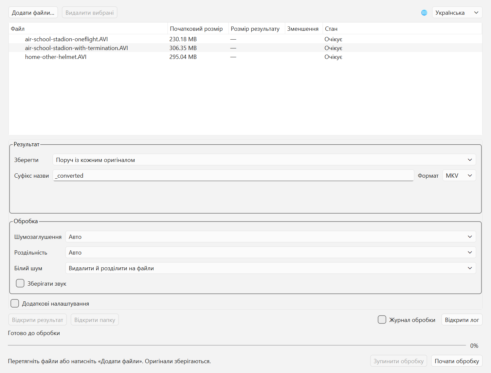

[English](../README.md) · [Русский](README_RU.md) · Українська · [Slovenčina](README_SK.md)

# analog-fpv-compressor

Програма для стиснення DVR-записів з аналогових FPV-дронів зі збереженням
зрозумілого руху дрона, геометрії сцени та видимих перешкод. Дрібні текстури
й візуальна краса мають нижчий пріоритет, ніж компактний файл і корисна інформація про політ.

Програма зменшує шум, вирізає підтверджені тривалі ділянки білого шуму та
перекодовує корисне відео. Оригінали зберігаються. Параметри можна залишити
автоматичними або змінити вручну. **Типово білий шум видаляється, а польоти
зберігаються в окремих нумерованих файлах. Звук типово видаляється.**

Творець програми — автор [YouTube-каналу про FPV-дрони](https://www.youtube.com/channel/UCGZrwTM5WFiGD-B0F7V_9Kw).

Поточні вихідні файли **0.3.0** містять Python-ядро, CLI, графічний інтерфейс,
пакетну обробку, автоматичні назви та розділення за білим шумом. Опублікований
Windows ZIP **0.3.0** містить GUI та CLI разом із Python, NumPy та Qt/PySide6.
Об’єднання
кількох вхідних записів та окремий інсталятор програми — майбутні завдання.

## Графічний інтерфейс

У підготовленому локальному середовищі:

```powershell
.\.venv\Scripts\fpv-compress-gui.exe
```

Для нового середовища див. [встановлення GUI](README-engineering.md#установка-gui).
FFmpeg потрібен для обох інтерфейсів. У ZIP відкрийте `fpv-compress-gui.exe`
подвійним клацанням; установлювати Python не потрібно. Скрипт створення ярлика з інженерної
інструкції також створює локальний `fpv-compress.lnk`.



1. Натисніть **Додати файли…** або перетягніть відео у вікно. Повтори виключаються.
2. За потреби виберіть папку результатів, суфікс і контейнер.
3. Залиште автоматичні параметри або змініть шумозаглушення, роздільність і білий шум.
4. Натисніть **Почати обробку**. Файли обробляються послідовно та незалежно.

Список мов розташований праворуч угорі. Під час першого запуску використовується
мова системи, якщо це англійська, російська, українська чи словацька; інакше —
англійська. Ручний вибір зберігається. Перемикання мови не перериває обробку;
параметри обробки заблоковані під час виконання завдання.

| Поле або елемент | Призначення |
|---|---|
| Додати файли / видалити вибрані | Керування чергою; також працює перетягування файлів. |
| Мова | English, Русский, Українська або Slovenčina. |
| Зберегти в / папка | Поруч із кожним оригіналом або у спільній папці результатів. |
| Суфікс назви / формат | Типово `_converted` і MKV; доступний MP4. Для частин додається номер. |
| Шумозаглушення | Авто, вимкнено, слабке, середнє або сильне. Вимкнення виключає фільтр і зменшує обсяг обробки. |
| Роздільність / власна роздільність | Авто, оригінальна або задані ширина й висота; впливає на деталізацію та розмір файлу. |
| Білий шум | Типово видалити й розділити на файли. Інші варіанти: видалити й об’єднати корисні частини або зберегти шум. |
| Зберегти звук | Типово вимкнено; звук вирізається синхронно з відео. |
| Додаткові параметри | Відкриває наведені нижче налаштування; зазвичай достатньо автоматичних значень. |
| Кодек | Типово AV1; альтернативний варіант — HEVC. |
| Режим стиснення / CRF / бітрейт | Авто, CRF або цільовий бітрейт. Менший CRF зберігає більше деталей, але збільшує файл. Бітрейт задається в біт/с, наприклад `500k`. |
| Пресет кодера | Компроміс швидкості та стиснення: `auto`, AV1 0–13 або назва пресета HEVC. |
| Деінтерлейсинг / порядок полів | Авто, вимкнено або ввімкнено; порядок — авто, TFF або BFF для черезрядкових записів. |
| Мінімальна тривалість білого шуму | `auto` або час підтвердження в секундах; короткі завади не повинні розділяти політ. |
| Потоки CPU | Запитаний бюджет потоків обробки; типово 4. |
| Папка FFmpeg | Порожнє поле означає автоматичний пошук; можна вибрати папку з `ffmpeg.exe` та `ffprobe.exe`. |
| Лише аналіз | Записати план, інтервали й назви частин у лог без кодування відео. |
| Почати / зупинити | Обробити чергу або скасувати поточне завдання; готові результати залишаються. |
| Журнал обробки / відкрити лог | Короткі повідомлення у вікні або повний діагностичний лог поточного запуску. |

Відсоток стосується поточного етапу та частини. Читання й перевірка можуть
показувати індикатор без визначеного відсотка. **Готово** з’являється лише після
перевірки результату. Таблиця показує розмір і зменшення; частини відображаються
дочірніми рядками. Виберіть результат або частину, щоб відкрити файл чи папку.
Діагностичні подробиці залишаються англійською.

## Консоль

Після встановлення з вихідних файлів достатньо вказати входи:

```powershell
.\.venv\Scripts\fpv-compress.exe -i "C:\Videos\my.avi"
.\.venv\Scripts\fpv-compress.exe -i "first.avi" "second.avi"
.\.venv\Scripts\fpv-compress.exe -i "C:\Videos\*.avi" --output-dir "converted" --format mp4
.\.venv\Scripts\fpv-compress.exe -i "*.avi" --output-dir "converted" --output-suffix "_small"
```

Типові результати — `my_converted_1.mkv`, `_2.mkv` тощо поруч з оригіналом.
`--output-dir` задає спільну папку та створює її за потреби;
`--output-suffix` замінює `_converted`, а `--format mp4` вибирає MP4.
Шаблони wildcard розкриває програма: передавайте їх у лапках. Повторний `-i`
підтримується, однаковий шлях обробляється один раз.

`--split-flights` увімкнено типово. Кожен непорожній збережений інтервал отримує
номер, навіть коротке повернення корисного відео. Це межі білого шуму, а не
визначення зльоту чи посадки: тривала втрата сигналу під час польоту теж може
розділити запис. Шум на початку/в кінці не створює порожніх файлів; єдина частина
також отримує `_1`. Синій екран і короткі непідтверджені завади не створюють меж.

```powershell
# Видалити шум, але об’єднати корисні інтервали:
.\.venv\Scripts\fpv-compress.exe -i "my.avi" --no-split-flights
# Зберегти шум і вимкнути автоматичне розділення:
.\.venv\Scripts\fpv-compress.exe -i "my.avi" --cut-no-signal off
# Записати план у лог без створення відео:
.\.venv\Scripts\fpv-compress.exe -i "my.avi" --analyze-only
# Явно задати параметри:
.\.venv\Scripts\fpv-compress.exe -i "my.avi" --denoise off --scale 480x360 --audio keep
```

`--no-signal-min-duration` задає час підтвердження шуму. `--audio keep` зберігає
синхронний звук: FLAC для MKV, AAC для MP4. Не можна одночасно явно задати CRF
і бітрейт. Deinterlace: `auto`, `off`, `on`; порядок полів: `auto`, `tff`, `bff`.
Усі параметри наведені в `--help`.

`-o` приймає один вхід і несумісний з `--output-dir` та `--output-suffix`;
у режимі розділення задає базову назву. Явний `--split-flights` несумісний
з `--cut-no-signal off`. Колізії назв і наявні результати відхиляються:
для повторної обробки виберіть іншу назву.

## Windows ZIP 0.3.0

1. Завантажте Windows x64 ZIP з [GitHub Releases](https://github.com/koolakoff/analog-fpv-compressor/releases).
2. Розпакуйте всю папку; `_internal/` має залишатися поруч з `fpv-compress.exe`.
3. **FFmpeg не входить до ZIP.** Якщо сумісної full-збірки немає, запустіть
   `setup-ffmpeg.cmd`: він завантажує та встановлює FFmpeg через WinGet; потрібен
   інтернет. Наявна full-інсталяція WinGet визначається автоматично.
4. Відкрийте `fpv-compress-gui.exe` подвійним клацанням або PowerShell для CLI:

```powershell
.\fpv-compress.exe -i "C:\Videos\flight.avi" -o "C:\Videos\flight-small.mkv"
```

Реліз призначений для Windows 10/11 x64 і містить Python, NumPy та Qt/PySide6.
Без WinGet завантажте [full-збірку FFmpeg](https://www.gyan.dev/ffmpeg/builds/)
і покладіть `ffmpeg.exe` та `ffprobe.exe` у `tools/` поруч із програмою.
Essentials не містить типового кодера AV1. Іншу інсталяцію можна вказати через
`--ffmpeg-dir`. Зберігайте всю папку разом. `licenses/` і `sources/` містять
ліцензії та відповідні вихідні файли Qt; установлювати їх не потрібно.

## Результати й діагностика

Поточна програма записує один **`fpv-compress.log` поруч із launcher**, або поруч
із Python середовища під час запуску через `python -m`. Локально:
`.venv\Scripts\fpv-compress.log`. **Новий запуск програми перезаписує лог.**
Кілька черг в одному відкритому GUI дописуються в той самий файл. Папка програми
має дозволяти запис; CLI `--log-file PATH` задає інше місце для всього запуску.

Лог містить версії, запитані й автоматичні параметри з обґрунтуваннями, видалені
інтервали оригіналу, початок/кінець обробки, перевірки, результати та помилки.
Покадровий прогрес не записується, окремі FFmpeg-логи не створюються.
**JSON-звіти поруч із відео не створюються**, зокрема під час аналізу чи розділення.
Плани й перевірки зберігаються в основному лозі. `--events-jsonl` вмикає машинні
події в stdout. Консольний вивід і діагностика — англійською.

Для аналізу помилки надішліть копію лога до наступного запуску. Старі звіти,
створені попередніми версіями, автоматично не видаляються. Помилка одного входу
не зупиняє чергу; CLI повертає 1 за наявності помилок. Ctrl+C або **Зупинити**
скасовує обробку й видаляє незавершені тимчасові файли, зберігаючи готові;
код скасування CLI — 130. Повністю шумний вхід відхиляється, якщо видалення шуму ввімкнено.

## Додаткова інформація

- [Інженерна інструкція: встановлення, середовище, API, перевірки та релізи](README-engineering.md).
- [Актуальні вимоги й рішення](source-of-truth.md), [план V1](plan-v1.md).
- [Вимірювання DVR](research/cli-validation-2026-10-04.md), [пакетні перевірки](research/batch-validation-2026-10-04.md), [перевірки GUI](research/gui-validation-2026-10-04.md).

Код програми поширюється за ліцензією [MIT](../LICENSE).
